# Pandas project analyzing data

The project requires the analysis of purchasing data using Python Pandas. The series of summary tables forms a report of meaningful insights. 

## Heroes of Pymoli

The fantasy game Heroes of Pymoli encourages players to purchase optional items to augment their experience. To understand the purchasing behavior of the players, the data was analyzed by purchases, gender, age, popular and profitable items. 

## Analysis

The Python Pandas analyzes the purchasing data contained in [purchase_data.csv](HeroesOfPymoli/Resources/purchase_data.csv). The following shows the first 5 rows of purchasing data. 

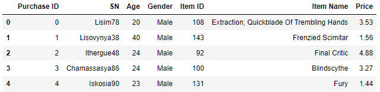

It was confirmed there were no missing values in the dataset prior to the analysis. 

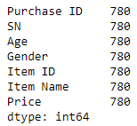

### Purchasing Analysis (Total)

* The total number of players who made purchases was determined. 

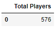

* The number of unique items, average purchase price, total number of purchases, and total revenue provides a overall picture of the purchasing data. 

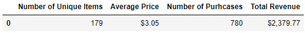

**Observations**

Several trends were immediately observed. First, the vast majority of Heroes of PyMoli players are male (84.03%; n=484/576), with female (14.06%; n=81/576) and other/non-disclosed (1.91%; n=11/576) accounting for the rest of the total population of players. 

Secondly, 179 unique items were purchased over 780 transactions and generated $2,379.99 total revenue. The item price ranged from $1.00 (Item `Stormfury Mace`) to $4.99 (Item `Whistling Mithril Warblade`). The average price over 780 transactions was $3.05, which is slightly below the median price of $3.15. This indicates a longer tail on the curve and a tendency for transactions to be closer to the lower end of the price range. Total revenue generated from item purchases is $2,379.77. 

### Gender Demographics

* The gender of players were male, female, or other/non-disclosed. The number of players and percentage of total players was determined for each gender type. 

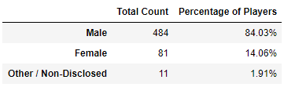

### Analysis of Purchases by Gender

* The purchasing behavior of players by gender is analyzed by purchase count, average purchase price, total purchase value, and average total purchase per person. 

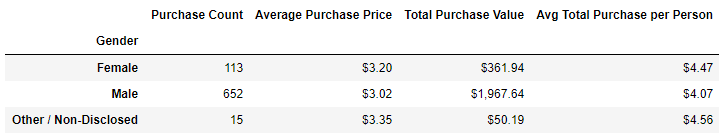

**Observations**

Purchases were analyzed by gender group. The vast majority of purchases were by males, with 653 transactions of the 780 total. The volume of transactions directly contributes to the revenue of $1,967.64, representing 83.7% of total revenue. However, players identifying as female ($4.47) or other/non-disclosed ($4.56) spend more per person compared to male players ($4.07) as seen in `Avg Total Purchase per Person`. They also purchase more expensive items as seen in `Average Purchase Price`. Females may be a potential target demographic as the company considers how to expand its customer base. 

### Age Demographics and Purchase Analysis

* The ages of the youngest (7 years old) and oldest (45 years old) players were determined to form age groups. The players making purchases were grouped by age accordingly, and the number of individuals and percentage of total players calculated for each age group. 

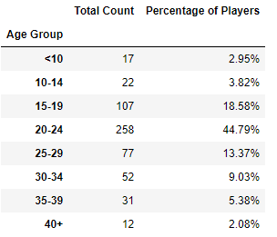

 The purchase count, average purchase price, total purchase value, and average total purchase per person was calculated by age group. 

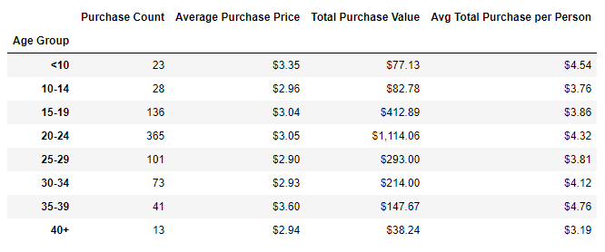

**Observations**

Most players are 20-24 years old (44.79%). The percentage increases to 76.74% when including the neighboring age groups of 15-19 and 25-29 year old players, identifying the 15-29 age demographic as the company's main customer base. 

This same age group of Heroes of PyMoli players (15-29 year olds) make most of the purchases (`Purchase Count`) and bring in the majority of the revenue (`Total Purchase Value`). Players between the ages of 20-24 account for 47% of all purchase transactions (`Purchase Count` is 365 of 780) and total revenue (`Total Purchase Value` is $1114.06 of $2379.77). As expected, this age demographic is the primary driver of revenue. 

Interestingly the 35-39 age group has the highest average total purchase per person. This age group may be a potential demographic group to target in the company's efforts to identify people who may have more disposable income to spend on Heroes of PyMoli. 

### Top Spenders

* The top spenders are ranked by total purchase value. Their purchase count and average purchase price are also calculated. 

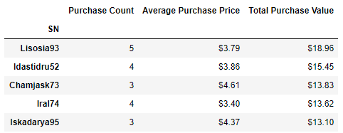

* Additional analysis was done to add the gender and ages to the Top Spenders dataframe. The top 10 are displayed. 

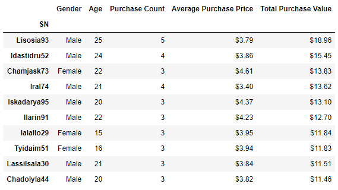

**Observations**

Looking at the first 5 Top Spenders dataframe reveals that these 5 players conduct 3-4 purchase transactions, and have total purchases valued from $13.10 to $18.96. As expected, their average purchase price is above the mean ($3.05) and median ($3.15) of the population. 

Interestingly the results of the additional analysis shows the 3rd top spender is female and has the highest average purchase price of the top 10 spenders. Females are 3 of the 10 top spenders. All 10 of the top spenders fall in the age range (15-29 year olds) making the most purchases. Again, females may be a potential target demographic, particularly in the 15-29 age range. 

### Most Popular Items

* The most popular items are identified by highest purchase count, along with the item price and total purchase value. The task was the identify the 5 most popular items. 

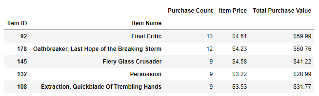

**Observations**

Looking at the 5 most purchased items, `Final Critic` and `Oathbreaker, Last Hope of the Breaking Storm` were purchased 13 and 12 times respectively. These items are very popular despite their high price points of $4.61 (`Final Critic`) and $4.23 (`Oathbreaker, Last Hope of the Breaking Storm`). The next 3 items, `Fiery Glass Crusader`, `Persuasion`, and `Extraction, Quickblade Of Trembling Hands`, were all purchased 9 times, with prices ranging from $3.22 to $4.58. Potentially these 5 most purchased items can be analyzed for commonalities in attributes, which could then be strategically applied to new items in development. It would be interesting to do a deeper analysis of the top 2 most purchased items, `Final Critic` and `Oathbreaker, Last Hope of the Breaking Storm`, for attributes that make the items particularly attractive to players. 

The dataframe was expanded to display the top 10 popular items by purchase count, which revealed the `Nirvana` item as one that was also purchased 9 times. It actually yielded higher revenue ($44.10) due to its higher price point ($4.90). It would be interesting to determine what attributes of `Nirvana` make it so desirable that players are willing to pay for this more expensive item at the same rate as the other items that were purchased 9 times. 

If total purchase value is taken into consideration with purchase count, `Nirvana` should be the 5th most popular item and replace `Extraction, Quickblade Of Trembling Hands` on the list. 

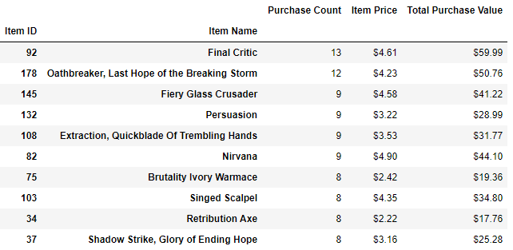

### Most Profitable Items

* The most profitable items are identified by highest total purchase value, along with purchase count and item price. The top 5 most profitable items are displayed. 

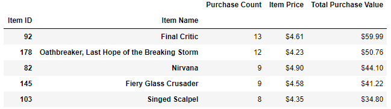

**Observations**

Not surprisingly, 3 of the 5 most profitable items, `Final Critic`, `Oathbreaker, Last Hope of the Breaking Storm`, and `Fiery Glass Crusader` were also identified as 3 of the top 5 most popular items. However two different items appear in the top 5 most profitable list. `Nirvana` ($4.90) and `Singed Scalpel` ($4.35) appear. Their item price points are higher compared to the 2 items pushed off the top 5 popular list, `Extraction, Quickblade Of Trembling Hands` ($3.53) and `Persuasion` ($3.22). Of the 4 items being discussed, `Singed Scalpel` was purchased the least (8 times) compared to the other 3 items (9 times), and just squeezed in as the 5th most profitable item purchased. Like in the analysis of `Nirvana` in the top 5 popular item analysis, it would be interesting to determine what attributes are desirable in `Singed Scalpel`. Players value `Singed Scalpel` and are willing to pay more, relative to other items. 

The dataframe was expanded to determine where the 2 items dropped off the popular list, `Extraction, Quickblade Of Trembling Hands` ($3.53) and `Persuasion` ($3.22), landed in the profitability list. Item `Extraction, Quickblade Of Trembling Hands` fell to position 7 and `Persuasion` to position 10. 

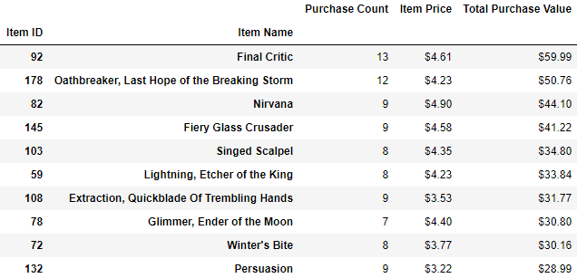

**Summary**

The fantasy game Heroes of Pymoli most effectively engages males players between the ages of 15-29. They are the company's primary customer base, who make the most number of purchases and drive the majority of revenue from item purchases. With 179 unique items and 780 transactions, the company's revenue of $2,379.77 has potential to increase with the analysis provided. Future analysis of item attributes, particularly those identified as popular and profitable, could be incorporated in new item development. Two demographic groups, female playes and players aged 35-39, are potential new targets for marketing as the company looks to expand its customer base. 